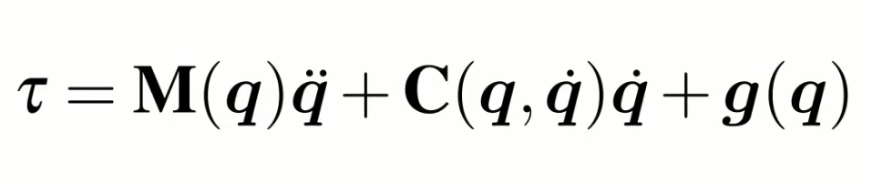
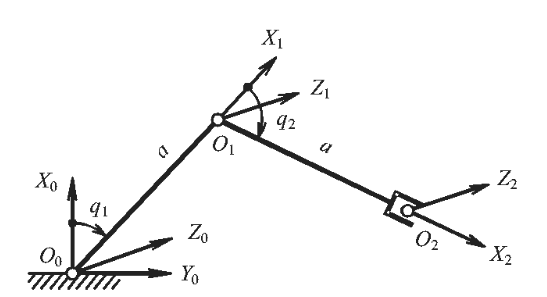
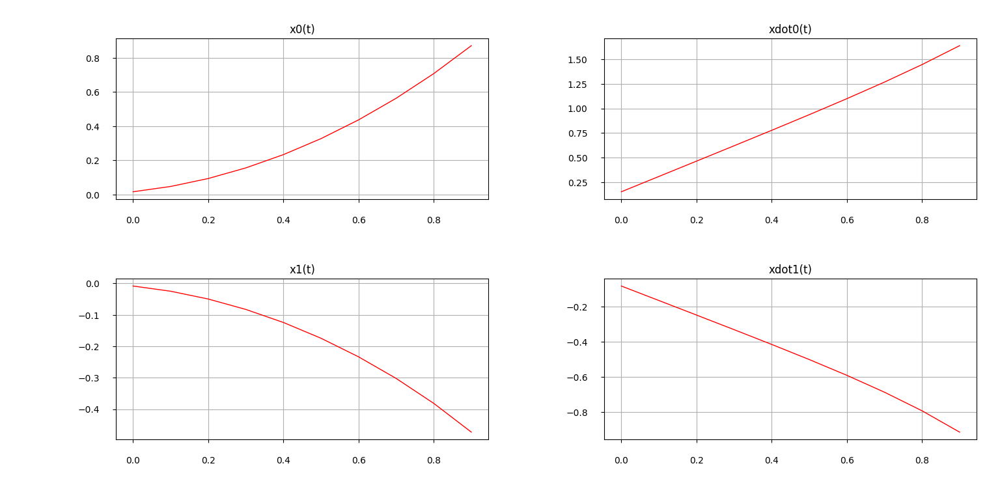

# Manipulator-dynamics
**This contains a function that calculates matrixes needed to simulate manipulator dinamics from given DH table. It also has a simulation example script.**  

## Content description
`LagrangianDynamics.py` contains function that generates 3 matixes used for modeling manipulator's dynamcs by following system:  
  
`Dynamic.py` contains example of `LagrangianDynamics.py` function application and modeling the dynamics of a simple system:  
  

## Setup 
**`LDynamics` from `LagrangianDynamics.py` takes 5 mandatory arguments and 1 optional:**  
_The function returns dynamics matrixes containing SymPy simbols_  

> DH (listlike (n,4)): DH table of your system's reference frame parameters
> 
> mass (list (n)): list of all link and tool masses
> 
> lengths (list (n)): list of all link and tool lengths
> 
> orients (list (n)): list of each link's orientation where 0 = z, 1 = y, 2 = x, so for eg. [0,2,1] for 3 link chain.
> 
> Inertions (list (n)): list of each link inertias along main axis
> 
> CreateTxt (bool (optional)): check for create 3 .txt files for each output matrix. Deafault False

It returns:  
> M (List (n,n)): Inertia Matrix M
> 
> C (List (n,1)): Coriolis matrix multiplied on qdot vector
> 
> G (List (n,1)): Gravity vector

_At the end of the function the is commented print for all matrixes if needed_
## Examples
As shown in the description the `Dynamic.py` models movement of a simple two linked robot. At the beginning of the script there are some approximate characteristics as well as DH table for this system.  
The sistem receives simple input `U` (that can be found in the main cycle) that cancels gravity influence and adds a small positive constant signal for all channels leading to following results:  
  
This input can be used for control of the model.  

